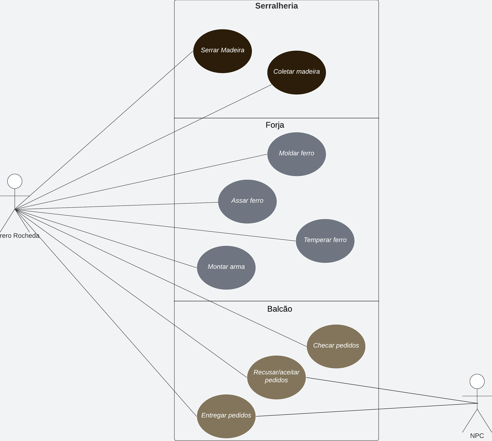
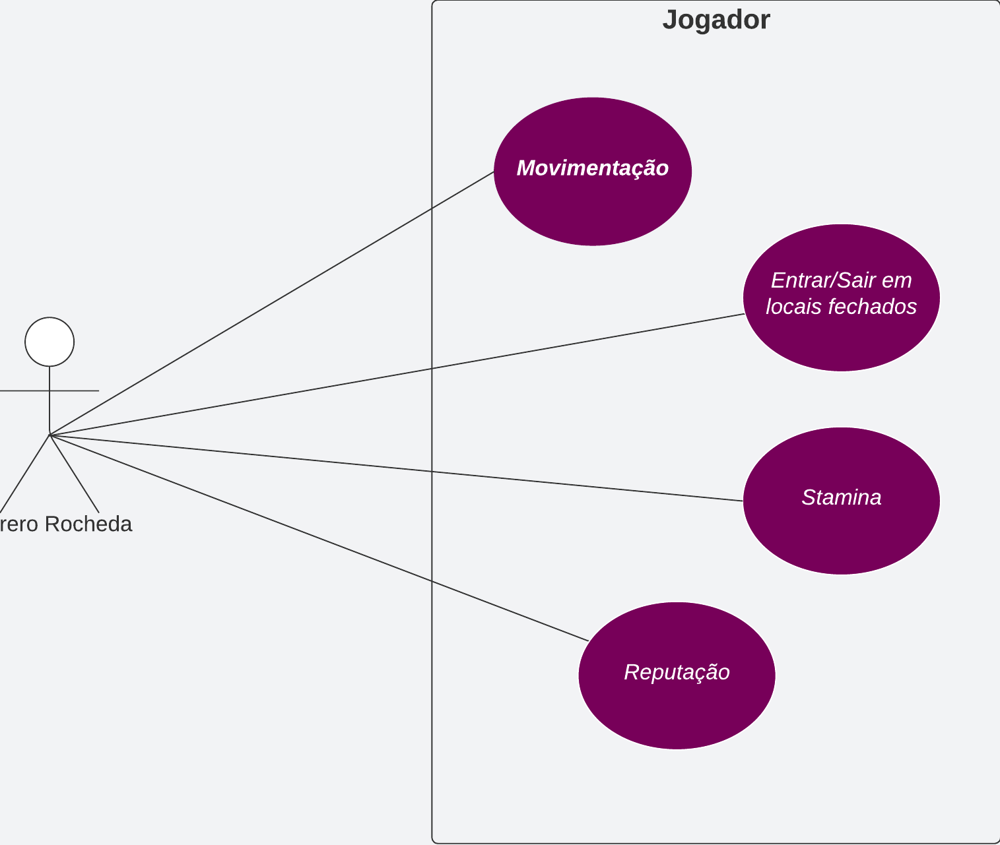
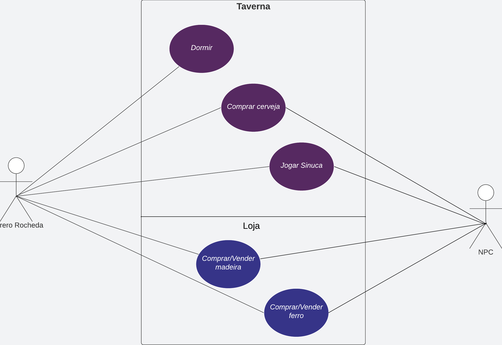
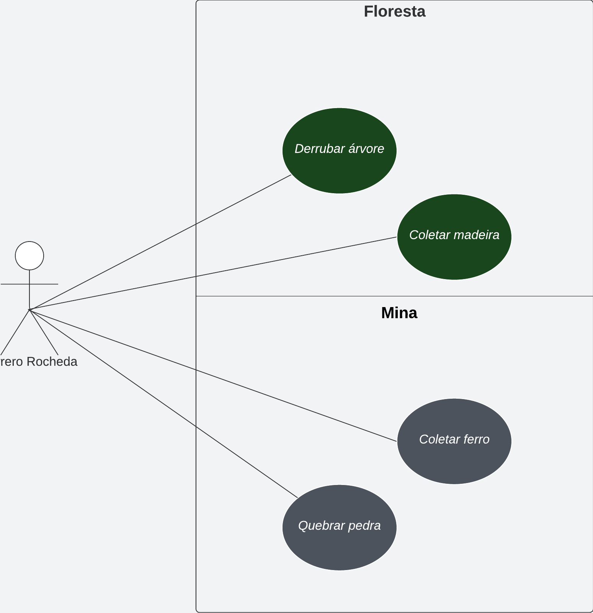

# Caso de Uso (MVP 1)

Quadro de detalhes dos desenvolvimento da primeira entrega do Ferrero Rocheda, demonstrando as interações do usuário com o sistema.

## Requisitos X Casos de Uso

| Requisito | Caso de Uso |
| :-------: | :---------: |
|           |             |

## Diagrama de Casos de Uso

### Oficina

### Jogador

### Cidade

### Coleta

